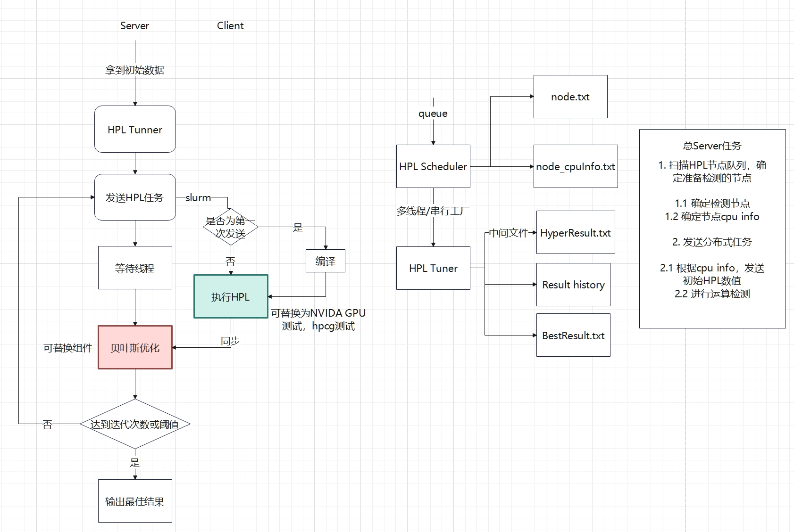
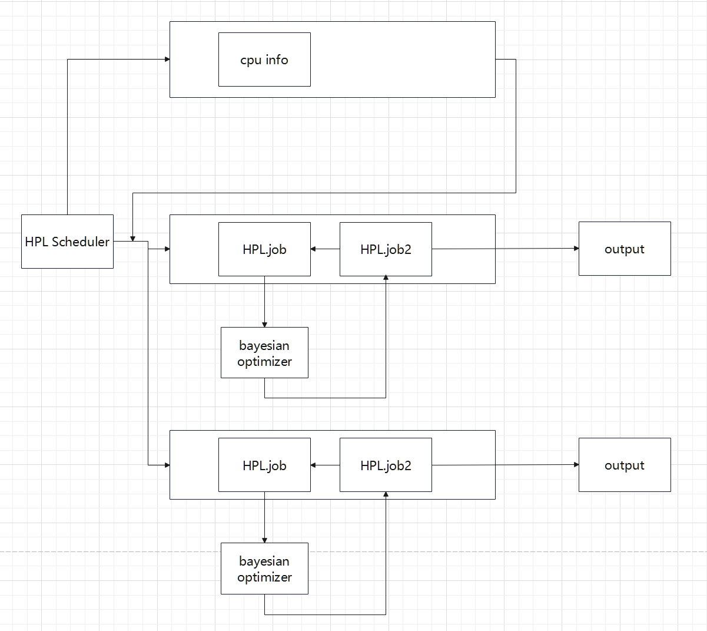

# Auto Tuning HPL on Qiming and Taiyi Cluster Using Bayesian Optimization

## SUSTech CCSE
#### Haibin Lai, Student Assistant 12211612@mail.sustech.edu.cn
### 

## Introduction

The High Performance Linpack (HPL) benchmark[4] is utilized to assess 
the floating-point performance of clusters and serves as 
the standard for evaluating supercomputer performance in 
the Top 500 benchmark[5]. Successfully running and optimizing 
HPL is fundamental for effective cluster management. 
Achieving peak performance involves tuning approximately fifteen parameters, 
such as matrix block sizes and algorithmic settings.

In this project, we applied **Bayesian optimization** **(BO)** to tune a
 CPU node inside a cluster system for the benchmark. Bayesian optimization is a 
fast and rapid optimization method on tuning the hyperparameter of a software.

## Framework

The following figure displays the main framework of the Tuning System. 

We determine the starting point using
empirical formula by detecting the size of memory and the number and performance of cores. Then we run bayesian 
optimization on one node with **N** iteration. On each iteration, we run HPL on the client
node of the cluster and take the PFLOPS as the target function, then the optimizer will  
try to maximize it.

At the end of the optimization, the system output the best group of solution with the best result.

## Parallel Working

The optimization system can also run with several thread, where it take a signal node as mission. So by sending a 
list to the system, it will submit it and solve them automatically.

## Future Work

Since the component of HPL can be changed, we can apply HPL's GPU version like [1] to the system. Also, HPCG
has been a rapid growing testing software in recent years. These can also be applied to the system. 

## Reference 
[1] iyazaki, T., Sato, I., Shimizu, N. (2018). Bayesian Optimization of HPC Systems for Energy Efficiency. In: Yokota, R., Weiland, M., Keyes, D., Trinitis, C. (eds) High Performance Computing. ISC High Performance 2018. Lecture Notes in Computer Science(), vol 10876. Springer, Cham. https://doi.org/10.1007/978-3-319-92040-5_3

[2] Willemsen, F., van Nieuwpoort, R., & van Werkhoven, B. (2021). Bayesian Optimization for auto-tuning GPU kernels. 2021 International Workshop on Performance Modeling, Benchmarking and Simulation of High Performance Computer Systems (PMBS), 106-117.https://www.semanticscholar.org/paper/Bayesian-Optimization-for-auto-tuning-GPU-kernels-Willemsen-Nieuwpoort/b6f70b9a25b49c4dbe1e0cec03060835f358bba9

[3] Jason Ansel, Shoaib Kamil, Kalyan Veeramachaneni, Jonathan Ragan-Kelley, Jeffrey Bosboom, Una-May O'Reilly, and Saman Amarasinghe. 2014. OpenTuner: an extensible framework for program autotuning. In Proceedings of the 23rd international conference on Parallel architectures and compilation (PACT '14). Association for Computing Machinery, New York, NY, USA, 303–316. https://doi.org/10.1145/2628071.2628092

[4] J. J. Dongarra, P. Luszczek, and A. Petitet, The
 LINPACK Benchmark: past, present and future,
 Concurrency and Computation: Practice and
 Experience, vol. 15, no. 9, pp. 803820, 2003.

[5]  Top500, Top 500 supercomputer sites,http://www.top500.org/, 2010.

